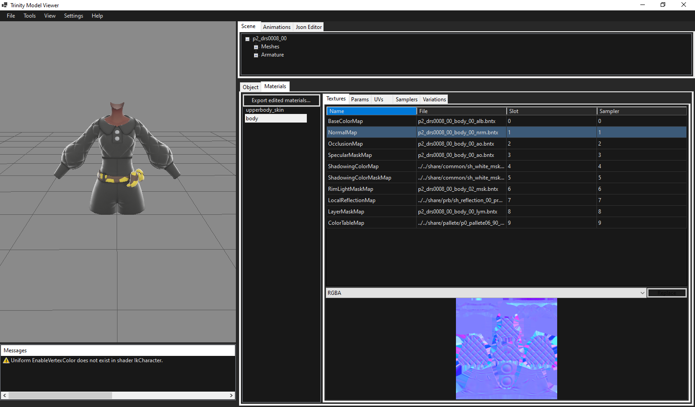
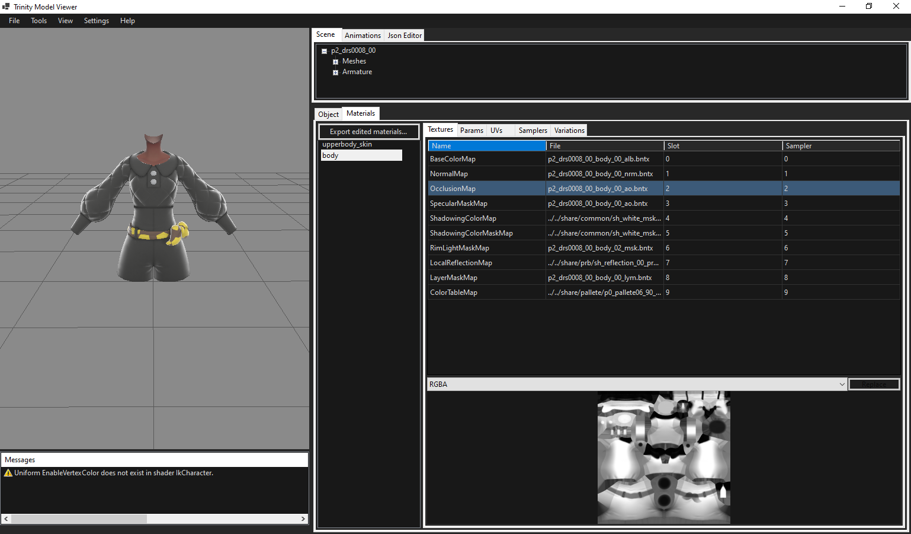
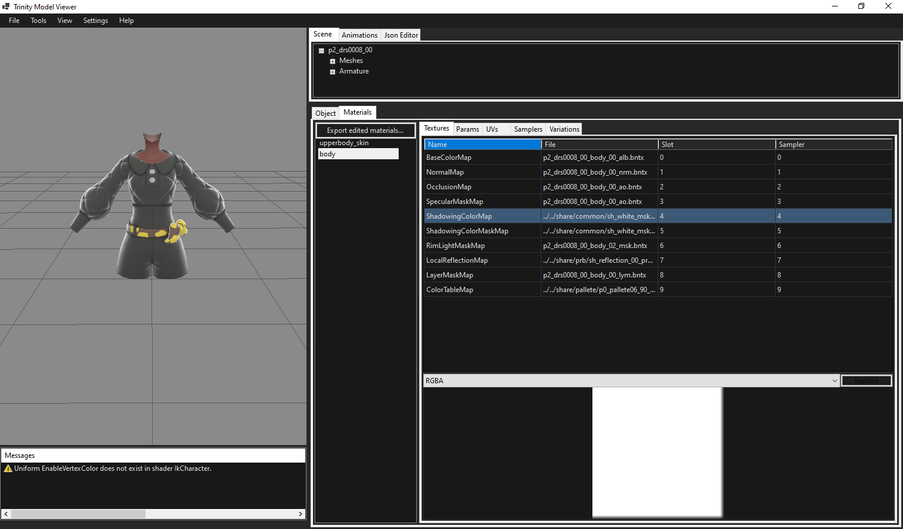
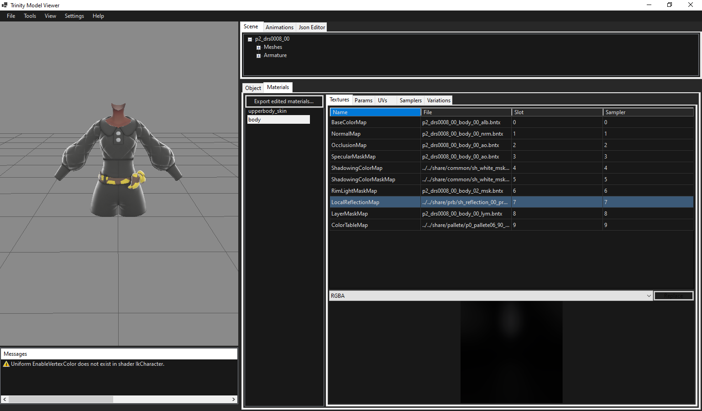
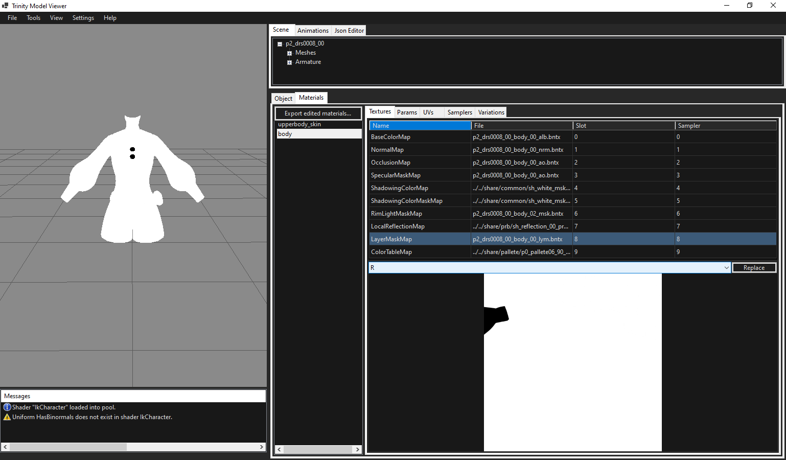
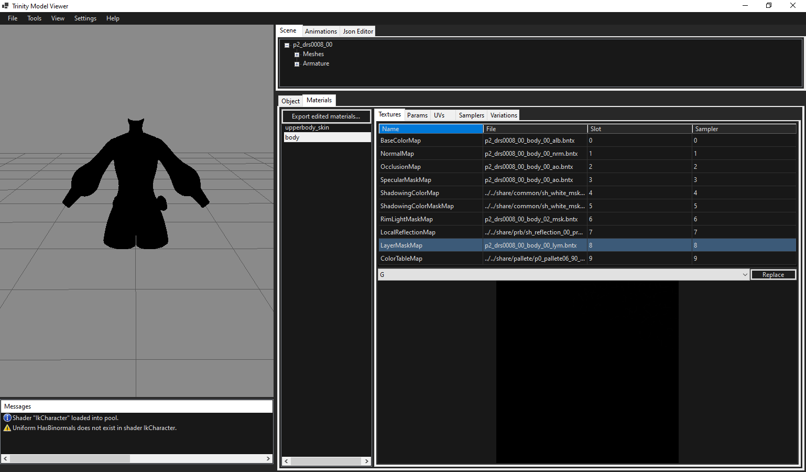
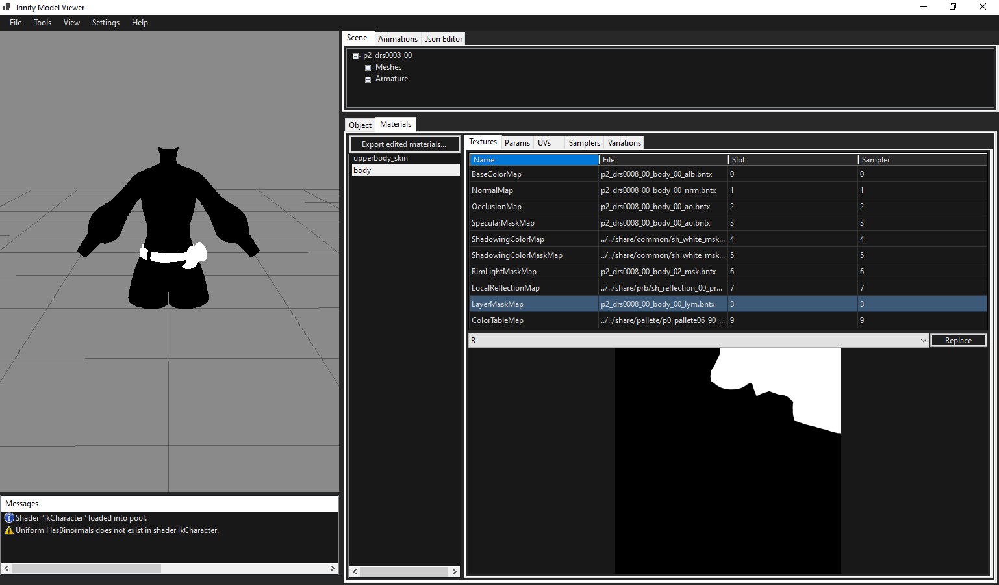
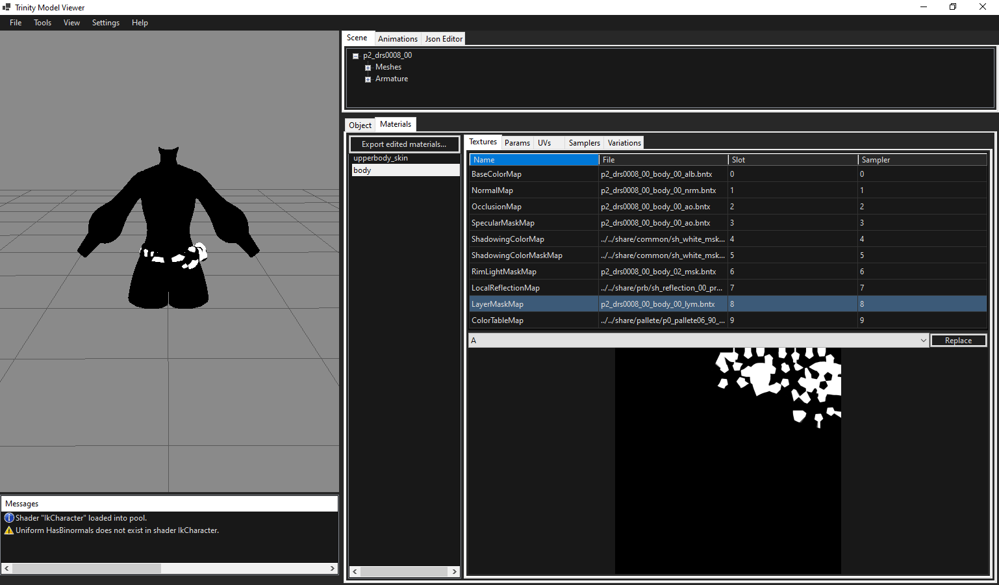
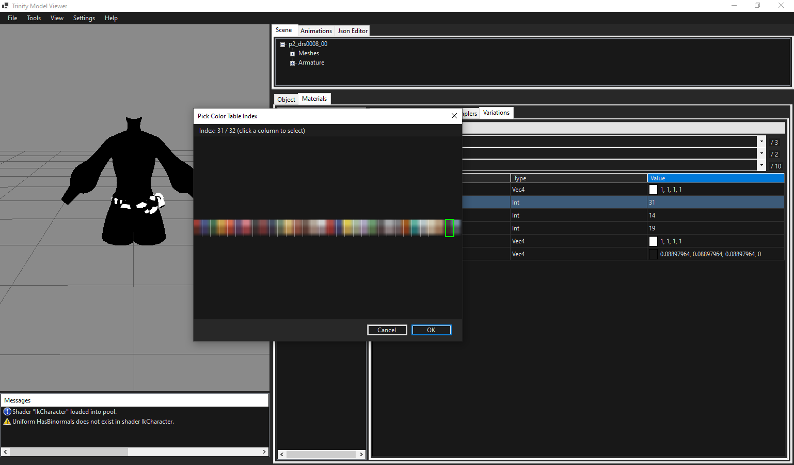
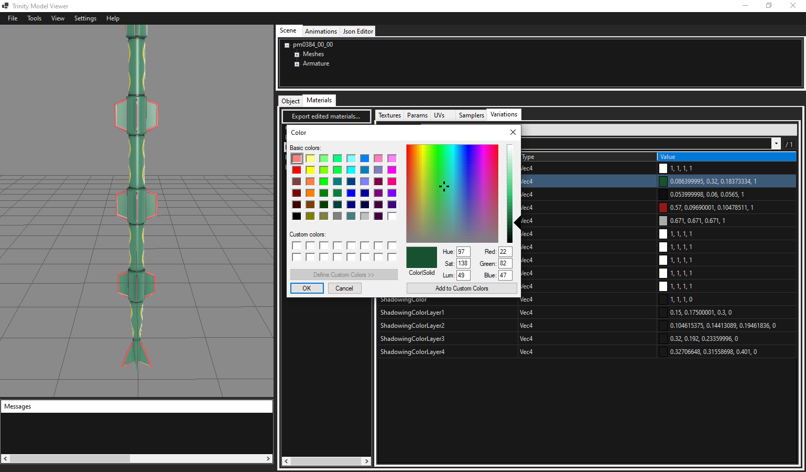

# TrinityModelViewer Materials (Info)

This is the “what does this texture/slot do?” part of the materials docs.

If you want the step-by-step workflow, see `/docs/guides/ikkaku/materialstextures/`.

## Common texture slots

### BaseColorMap

Drives the base color (impressive right?). On a lot of Pokemon/clothing models the BaseColorMap is shaded pretty “plain” (often white/gray), then the actual colors are driven by the LayerMaskMap + variations.

### NormalMap

Standard PBR normals.

### OcclusionMap / Specular maps

Occlusion provides baked in shading while specular maps help drive reflections. Usually they both use the same texture if present.

### ShadowingColor / ShadowingColorMaskMap

Provide a flat color to be subtly applied to the model at runtime (TrinityModelViewer currently doesnt apply this).

### RimLightMaskMap / LocalReflectionMap

Help with reflections.

## LayerMaskMap (the important one for recolors)

LayerMaskMap has four different channels which decide what colors fill in on what parts of the mesh.

For example the Red channel white parts show the BaseColorLayer1 or BaseColorIndex1 that is applied to the mesh.

- Red channel drives BaseColorLayer1 / BaseColorIndex1
  
- Green channel drives BaseColorLayer2 / BaseColorIndex2
  
- Blue channel drives BaseColorLayer3 / BaseColorIndex3
  
- Alpha channel drives BaseColorLayer4 / BaseColorIndex4
  

You can observe the parts which use the red channel layermask through the shader debug options along with the ikcharacter backup shader. Opening the UV tab is also useful in showing what colors go where.

## Base color index vs base color layer

You may be wondering what the difference between base color index and base color layer is:

- Base color index pulls from an index on a colortablemap texture which you can see on a texture map.
  - They usually have 32 indices which correspond to the different colors on that color table from left to right.
  - The top part drives the actual color while the bottom drives the shadowing.
  - If youre not content with the provided colortablemap feel free to switch it out.
  - By clicking the value column for your desired column you can edit which index is used for that specific material/set.
  
- Basecolorlayer refers to an actual color value set in the material which is applied to the respective channel mask.
  - You can change it by clicking the color swatch next to the value.
  
