# TrinityModelViewer Materials / Textures (Guide)

Picking up from the model importing guide we can now configure our textures.

If you want the “what does this texture do?” part, see `/docs/guides/ikkaku/materials/`.

## Quick path (if you only want recolors)

If you only want to edit base colors for a pokemon or item of clothing you only need to go to the variations tab and edit from there then export your edited materials.
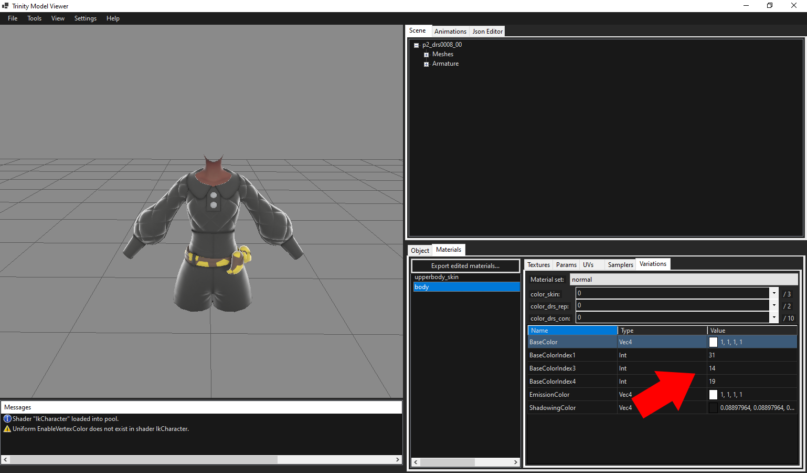

## Replacing textures (workflow)

Continuing our model importing guide, you can start replacing your desired textures.

- If you only want one color for your model no matter what color options there may be in game you should fill in the basecolormap with your colored texture. (Make sure your NormalMaps, AO, and EnableColorTableMap are set to False)
  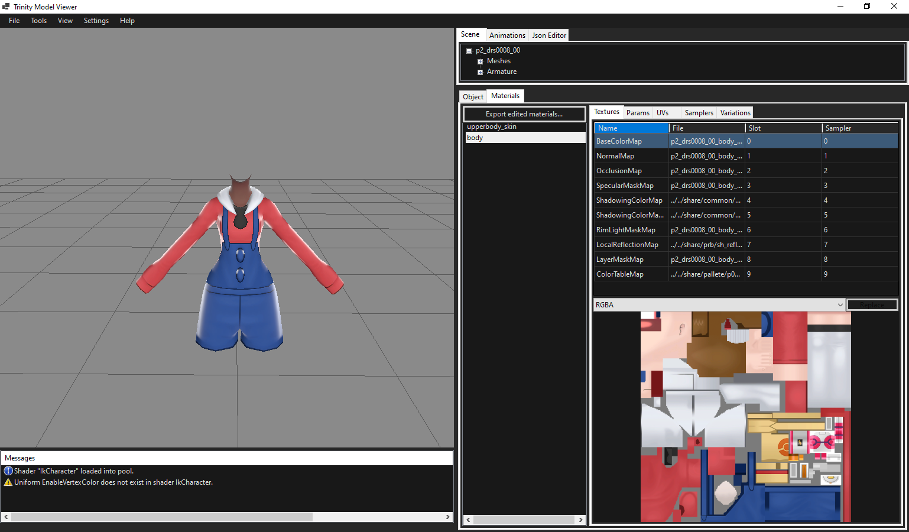
- If you want colors to be driven by the games layermask then color things by grayscale gradient where white is fully influenced by color and black is not.
  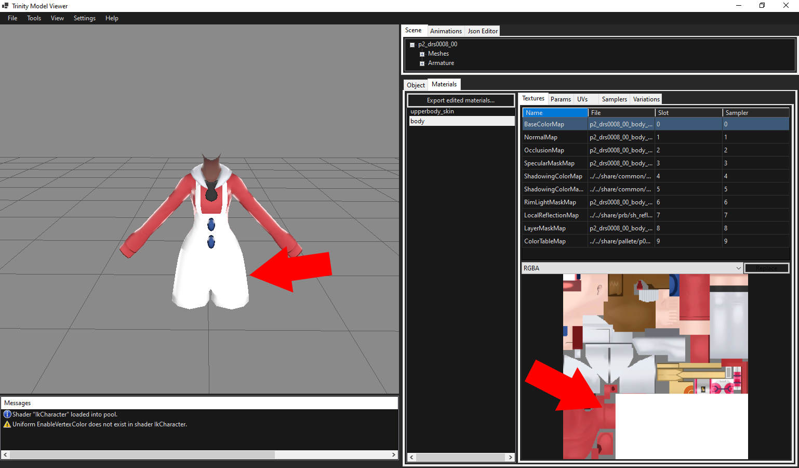
  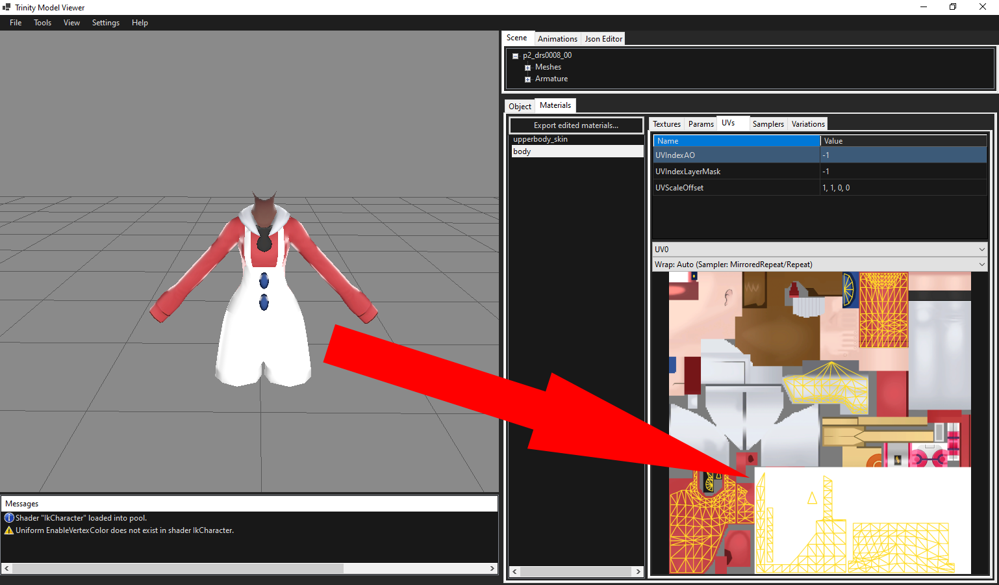
- You can also go ahead and import your models normal and occlusion maps if you so choose.
  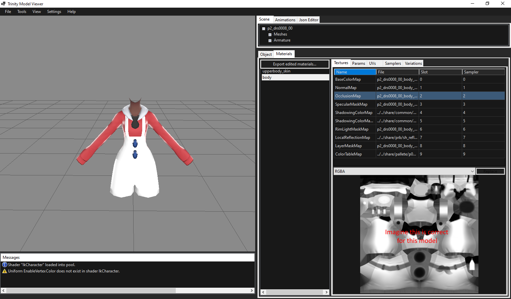

Remember TrinityModelViewer doesn't export bntx yet so our texture changes wont apply if we just export straight away.

## Exporting textures (important)

You must replace the actual textures through switch toolbox. (https://github.com/KillzXGaming/Switch-Toolbox)

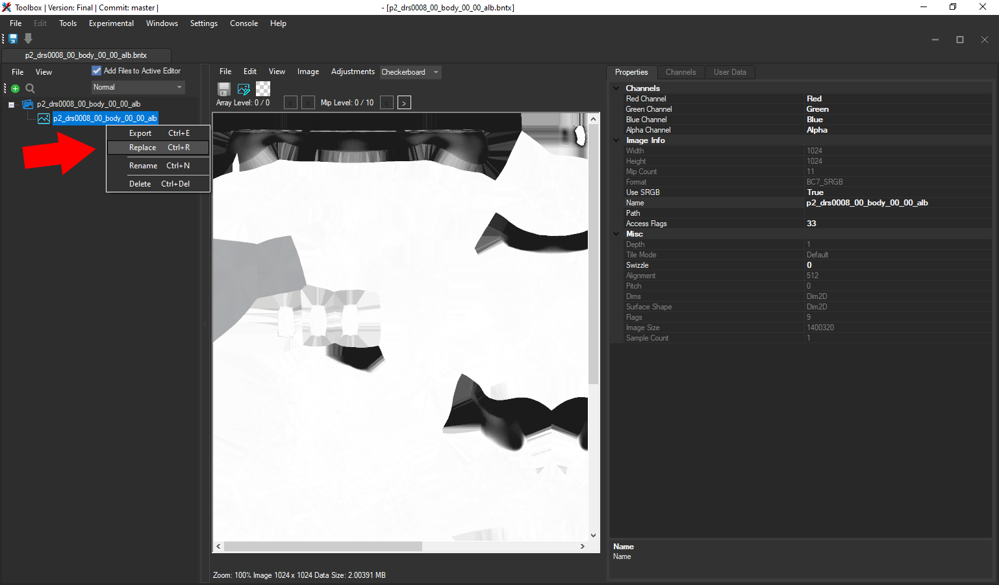
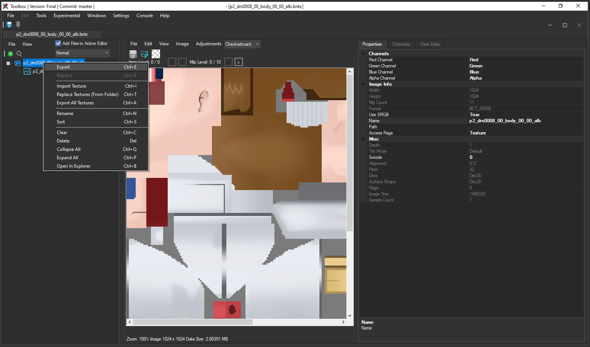
I advise you to set up the textures and export them through TMV because toolbox has an issue with its channel replacement system.
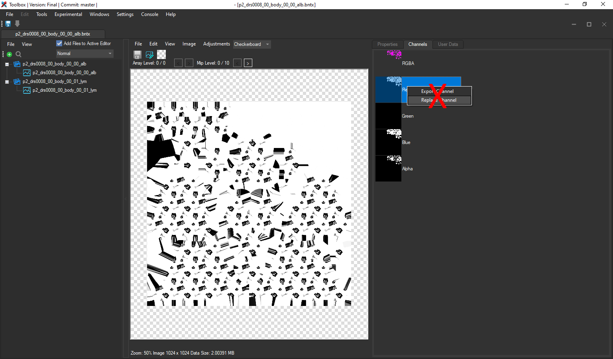
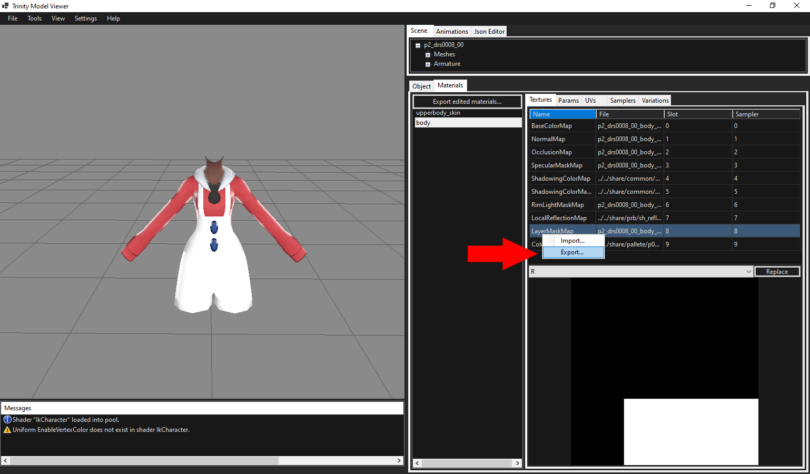

## Example: using LayerMaskMap correctly

Heres an example for using the layer mask map correctly:

Lets say we want to drive the overalls color with a layer mask through base color index 1.

1. Find where the specific UVs overlap in the material for the overalls.
   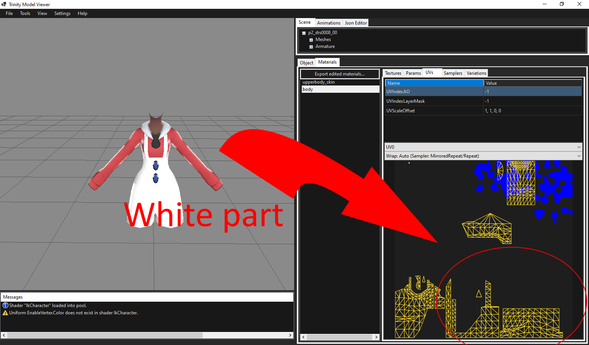
2. Color those parts white and make the rest of the material black.
   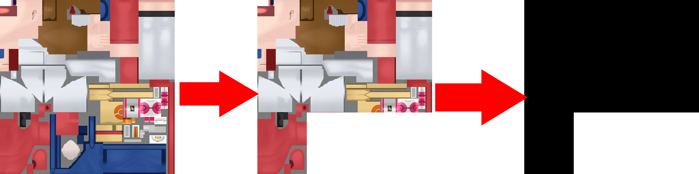
3. Change the color channel to red and import my newly made texture.
   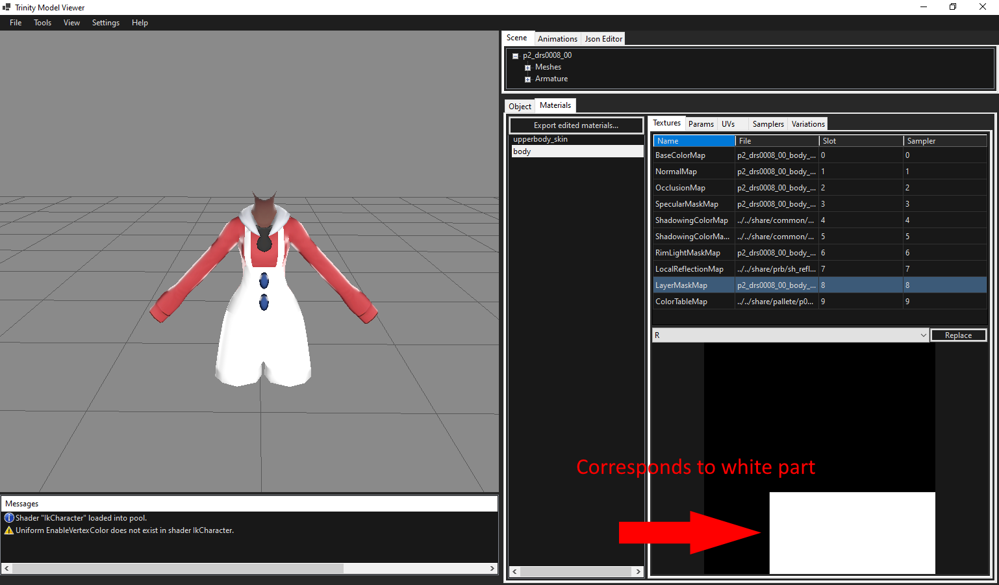

This will update the model and the 1st colorlayer will only be applied to that part of the mesh.

Please make sure your mask layers arent overlapping.

## Exporting back to the game

Whenever youre done making your model look nice, go ahead and click the Export Trinity... Button to export to your correct directory.
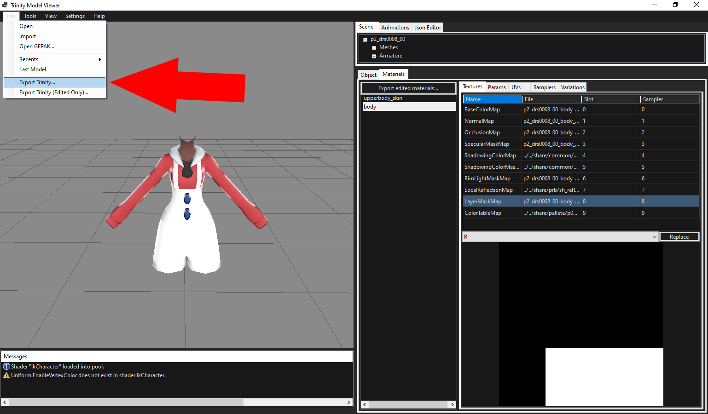

Either use the TrinityModLoader or TrinityBypass to load your mod.

Look at it in game and tweak your materials based on what you want.

## Notes / future improvements

This guide may need expanding, if any individual wants to go through and document which values in the params tab change what please reach out on the pokemodding discord.

Quick info on Variations: Trmmts may refer to different material sets the model may use for colors in game, go through your material sets and color_*_rep and color_*_con until the colors line up with whats in game, once youre sure they line up you can sucessfully edit them and export back to the game.

If you'd rather perform these actions on the json converted binaries, feel free to use the Json Editor to do so!
