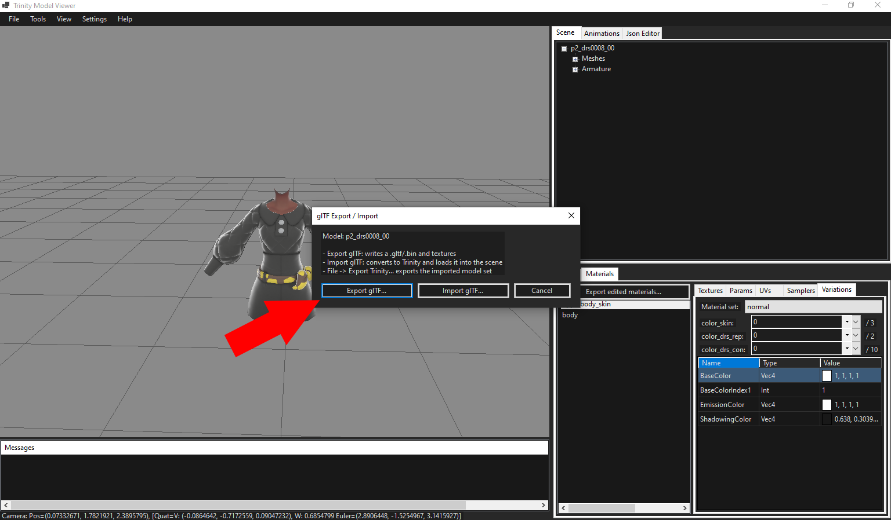
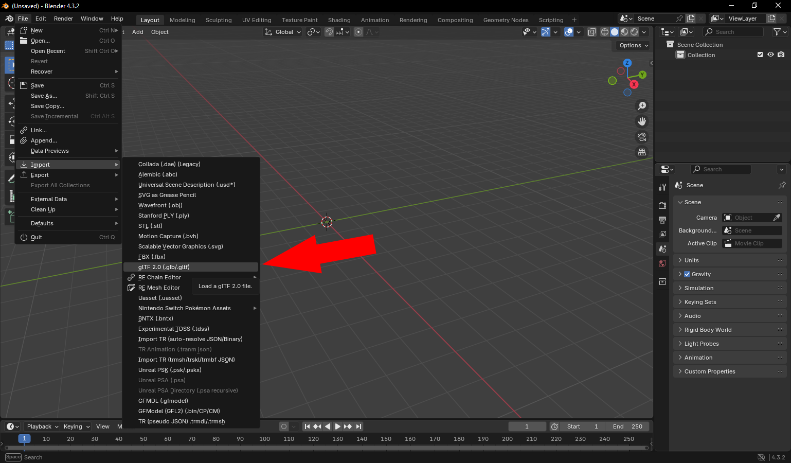
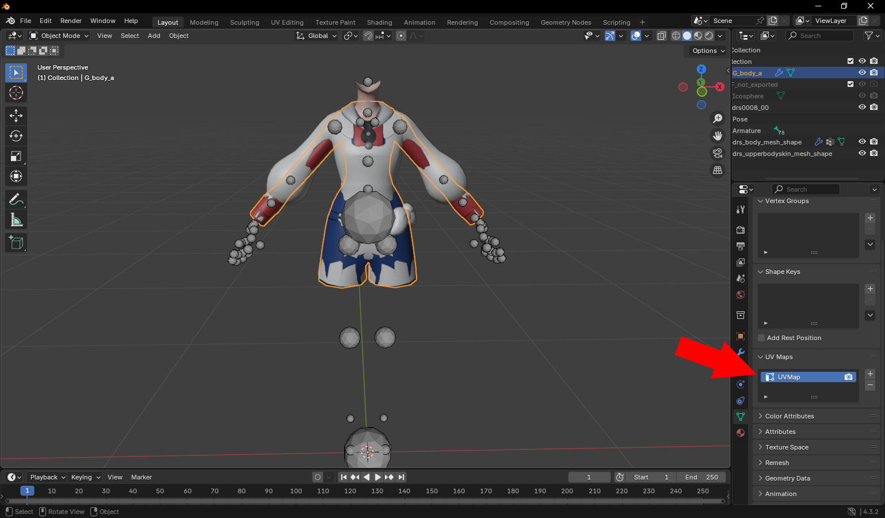
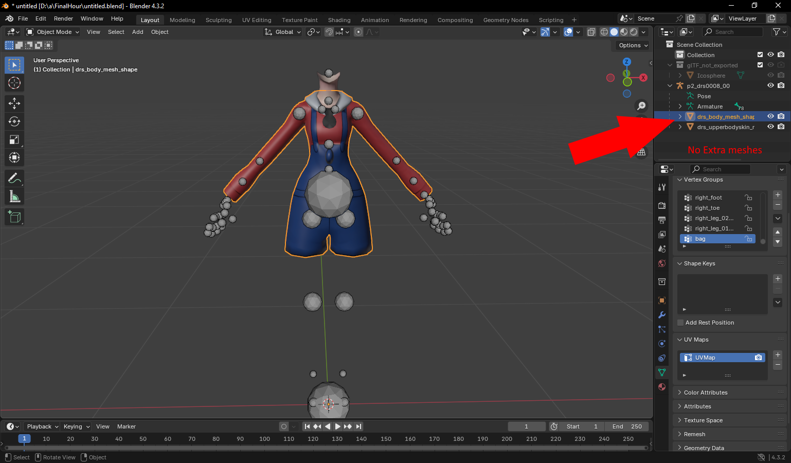
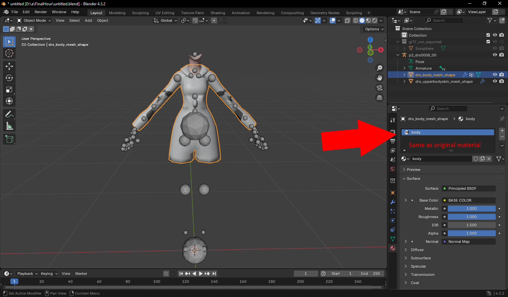
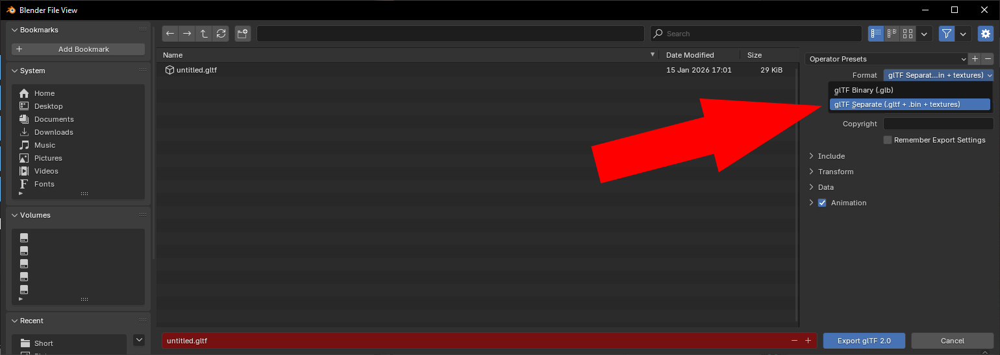
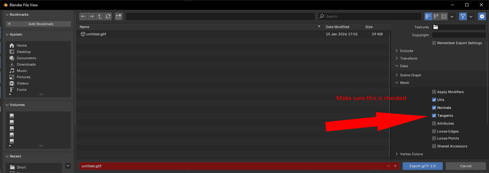
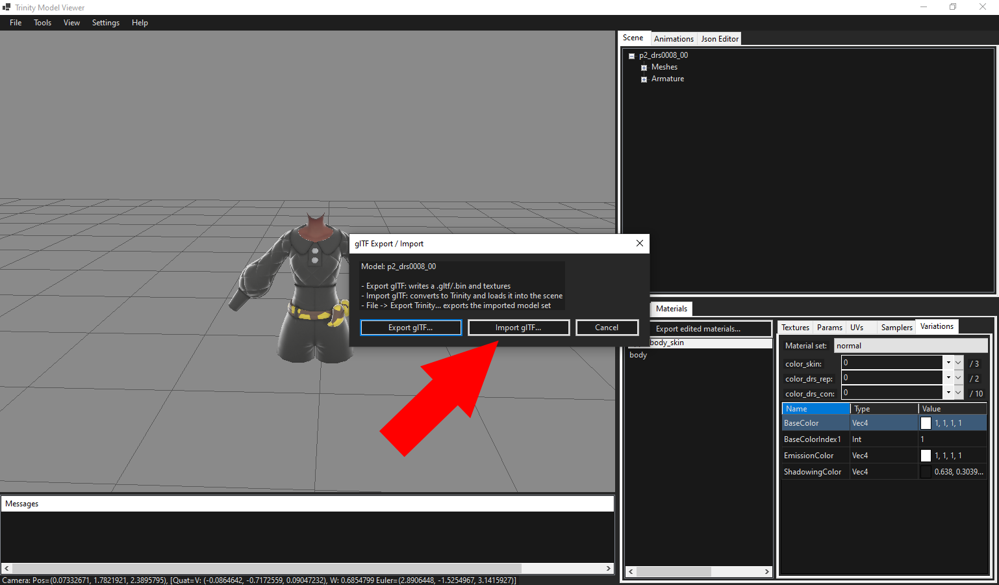
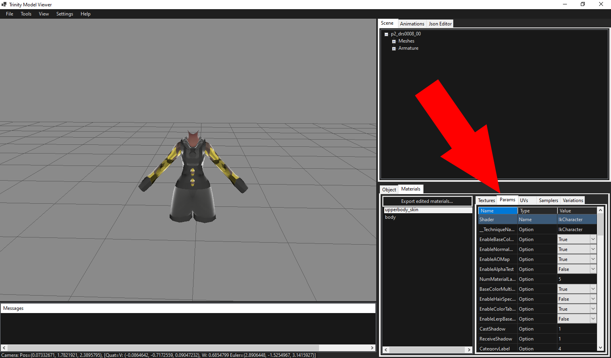
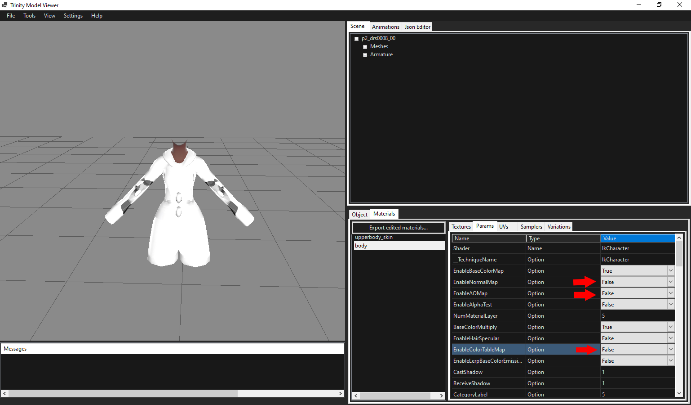

# Legends Trinity Model Importing Guide (ZA Clothing Focus)

## Export from TrinityModelViewer

1. Export your selected model with export gltf through the modify button.
   
2. Import into your software of choice, this guide will be using blender.
   

Your model may not look the same as it does in game/in TrinityModelViewer, but thats because blender doesnt have the necessary shaders set up natively for it.

## In Blender

1. Line Up your meshes and transfer weights, or manually repaint your mesh. (There are plenty of guides out there that show you how https://gamebanana.com/tuts/15580 or https://www.youtube.com/watch?v=IPQ2QVVIxLU)
2. Make sure your UV0 is called `UVMap`.
   
3. Merge or rename your New mesh to be the same as the original.
   - Example: we renamed `G_body_a` to `drs_body_mesh_shape`.
   
4. Make sure your material names only come from the ones imported (in our case its `body`) and delete the other material.
   - Materials dont matter now as we can configure them later in Trinity Model Viewer, so just make sure the names match up for now and your scene is clean and UV names are correct.
   
5. If you have extra meshes, either map them to other in game body parts or merge them and their UVs and textures.
   - I may expand this guide later to show how to do so.

## Export from Blender

- On export do glb/gltf and make sure you change the format to glTF not glb.
  
- In `Data -> Mesh` enable tangents on export or else your model wont shade correctly.
  

## Import back into TrinityModelViewer

1. Go back to TrinityModelViewer.
2. Right click your model and hit import gltf then import your exported gltf.
   

## Export Trinity files

1. Go to `Materials -> body -> params`.
   
2. Set Enable Normal Map and Enable AO Map to false (unless you want to make your own).
3. Set enable color table to false as well if you only want to use your (soon to be) imported albedo color only.
   
4. Hit `File -> Export Trinity...` and put it in your desired spot.
